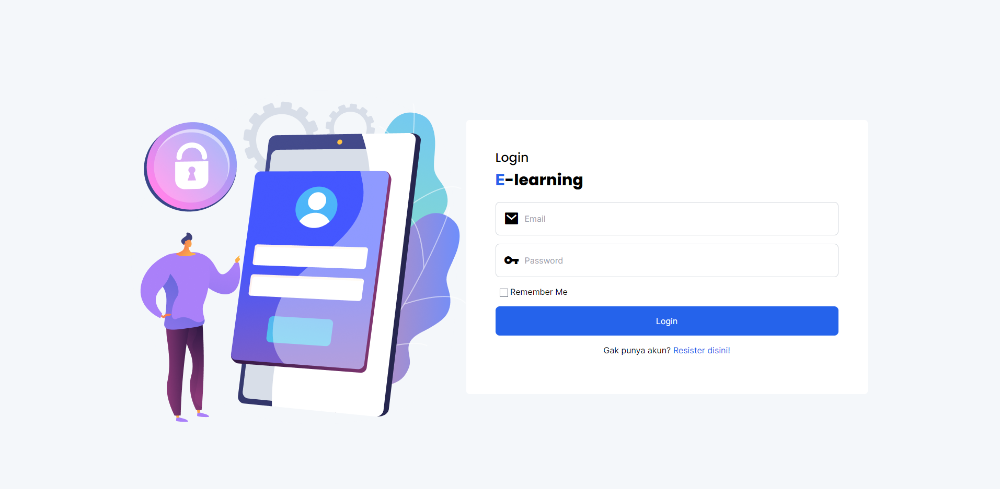
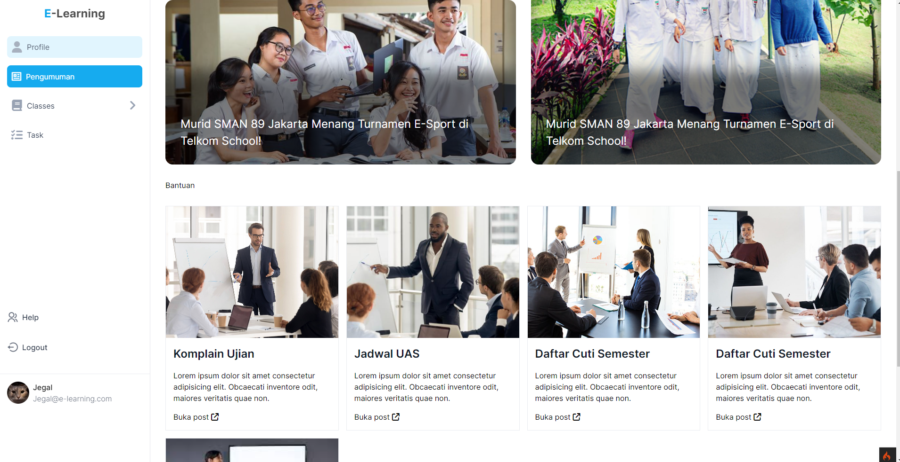
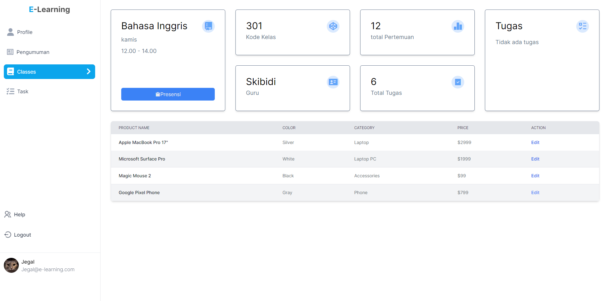

# E-learning CI4

An intuitive and robust e-learning platform built using CodeIgniter 4 and TailwindCSS. This project aims to provide a seamless learning experience for both students and instructors, featuring a range of functionalities from course management to real-time communication.

## Preview







## Features

- Login / Logout / Register
- Navigation
- presence
- Tasks 


## Acknowledgements

 - [CodeIgniter 4](https://codeigniter.com/user_guide/intro/index.html)
 - [Mysql](https://www.w3schools.com/MySQL/default.asp)
 - [Tailwindcss](https://tailwindcss.com/docs/installation)
 - [NodeJs](https://nodejs.org/en/learn/getting-started/introduction-to-nodejs)
 - [Html, css, Js](https://www.freecodecamp.org/news/html-css-and-javascript-explained-for-beginners/)


## Tech Stack

**Frontend:** vanilla css, tailwindcss

**Backend:** CodeIgniter

**Server:** Mysql

## Installation

Install this project with npm

```bash
  git clone https://github.com/Zelvrs/e-learning-ci4.git
  cd e-learning-ci4
  npm install 
```
Install Depedency

- Create **.env** in root project, set the env to: 
```bash
database.default.hostname = yourhostname
database.default.database = yourdatabase
database.default.username = yourusername
database.default.password = 
database.default.DBDriver = MySQLi
database.default.DBPrefix =
database.default.port = 3306
```

Run migrations:

```bash
  php spark migrate
  composer install
  composer update
```

Test the development server:

```bash
  php spark serve
```
## Running development

To run devs, run the following command

```bash
  npm run dev
```

